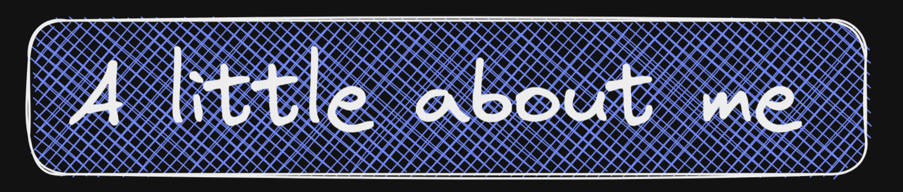
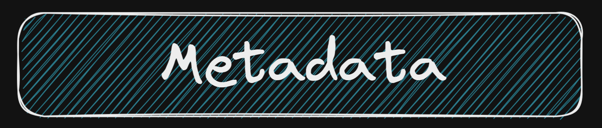

<p align="center">

</p>

#### Building Notifi 🛠️

I am building an open source web app crash monitoring tool. Check it out here 👉 [Notifi](https://www.notifi.site)

```json
{
  "name": "Emil Sharier S",
  "occupation": "Software Engineer",
  "based_in": "Kerala, India",
  "current_organisation": "Vamstar",
  "interests": [
    "Web development",
    "Mobile application development",
    "Design mockups/wireframes"
  ]
}
```

---

<p align="center">


</p>

```
💡 Ha ha you can find me trying to cross the no mans land of tech known as Javascript 😛
```

---

<p align="center">

<p align="center">


          
</p>
</p>

---

<p align="center">




</p>

---

## My spotify activity

[](https://github.com/kittinan/spotify-github-profile)
